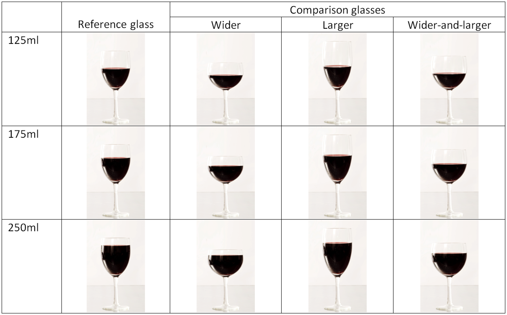

# DeepBeerLevelz

DISCLAIMER: No beer was wasted in the making of this project.

Do see the video below which plays nicely on markdown depending somewhat on your browser.
Otherwise please refer to the jupyter notebook [deep_temp-Class.ipynb](deep_temp-Class.ipynb) for a breakdown of the project, I write below the motivation and summary which can also be found in the notebook.

## Motivation

I was enjoying drinks with a friend at my flat and were drinking a particularly exceptional lambic beer (Cantillon Brabantiae, 2018. See: https://www.cantillon.be/) and wanted to ensure to distribute it as equitatively as possible.

Unfortunately I've never made the habit of buying glasses and thus have no matching glasses and just a collection of small missmatched glasses and jars. We tried our best to be equitative by timing the time of pouring with a consistent stream size rather than by judging the volume. We took this approach because we knew that evaluating volume can be deceptive, especially with nonlinear shaped glasses such as some of mine [Pechey et al, (2015). *PLoS One*. 10(12):e0144536. https://doi.org/10.1371/journal.pone.0144536]:

We further reasoned that as this is a 750ml beer bottle. If we were off by a relatively small amount, say one person received 120ml and the other 100ml. The more small glasses we had, the larger the disparity of consumption we would have if the difference between servings remained consistent. Indeed for this particular bottle, it would mean that one person would consume on average 20% more than the other. In the end we consumed two 750ml bottles, if one consumed 20% more than the other. 

One can find that in the end one person drinks 681ml, while the other drinks 818ml, a full 147ml more than the other, more than a full glass!

In the end we got distracted by other topics and estimated our servings, yet the question stuck with me for a couple of days. Then I wondered, could I device a computer vision model that accurately returns the volume in the glass? I thought it could be a fun regression problem, upon researching further I found that there are comparatively few computer vision deep neural network models solving regression than classification or detection problems. I am not sure if there are simply overall less such problems to solve or there is something about them that makes them more troublesome.

I have a webcam, and I can train the model with accurate measurements, so let's give it a go.

## Results in a video
I've embedded the video below of a glass filling up with beer and its predicted value.

https://user-images.githubusercontent.com/43865617/159798476-0b6eaa33-3283-47d8-9dc0-aa98844eee13.mp4

Link in case the video does not play, which seems to happen with markdown on github: https://github.com/edgar-hd/deepBeerLevelz/tree/main/sequence_datasets/2gsequence_video.mp4

## Summary and thoughts
I have made a prototype algorithm able to accurately calculate the amount of blond beer in my house glasses. These glasses are substantially different to each other and have irregular shapes and patterns that the algorithm is able to overcome, and it still accurately returns the volume. It also seems to focus sufficiently on the glass such that a stream of liquid doesn't affect the measurements too much, and the slight variations in angles mean I don't need to worry too much about where I place my glass, as long as it's roughly a similar position.

Some thoughts:
- I had not accounted for foam in the beer, and a clear future develompent is to train the algorithm for different amount of foam with the same total beer volume. At present it calculates how much liquid beer is in the glass. As we know from the study of polydispersed fluids, depending on the beer type and speed of pouring the density of the foam may be different, the density may also not be uniform along the *y* axis thus leading to differences in the prediction, I don't know how substantial the differences in density can truly be but it's an interesting thought nonetheless.

- I tried a pre-trained image detection algorithm and it consistently captured the glass, which could help me to develop a more tailored approache where the glass can be in more diverse positions and backgrounds (https://tfhub.dev/google/faster_rcnn/openimages_v4/inception_resnet_v2/1 and https://tfhub.dev/google/openimages_v4/ssd/mobilenet_v2/1). The image detection algorithm however is comparatively very slow, and also sometimes trims the glasses in half, so further training would need to be done on that network for my specific objects, this is meant to be a fun project so I don't want to spend loads of time drawing boxes around glasses. I suspect the fact they are transparent is a major issue for accurate detection.

- If I were to fit this to more beer types, say stout, brune, etc. The algorithm may be able to interpolate between different beer types, this may be a future development. At present I have only blond belgian beers at home, and have done for the last week.

- It could be interesting also if I fit more glass types, would the neural network eventually be able to perform decently on glasses it hasn't seen before? I suspect not, but maybe similar glasses? Or a broken glass? This feels a bit like speculating about the "black box" but still interesting to think about.

